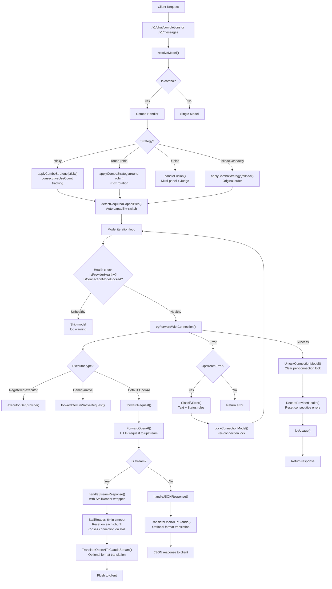
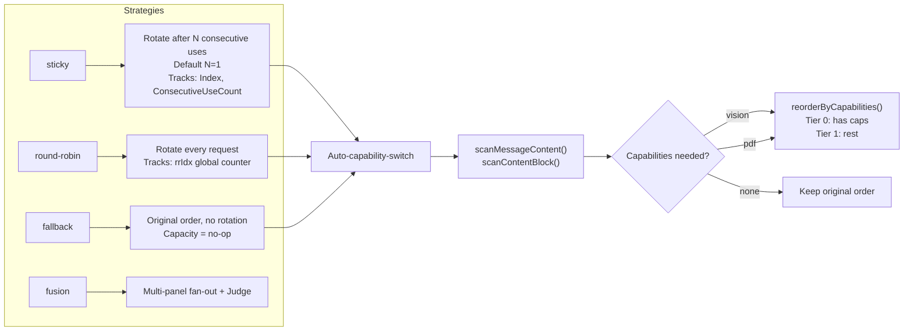
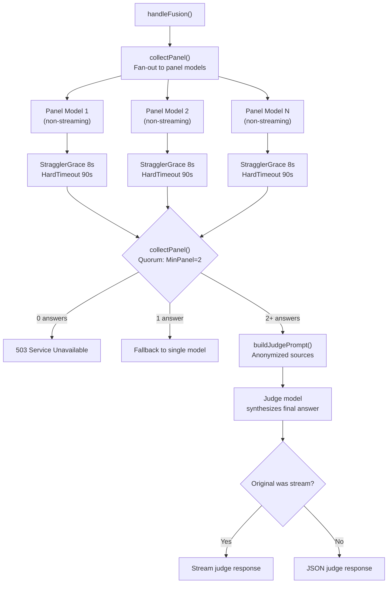
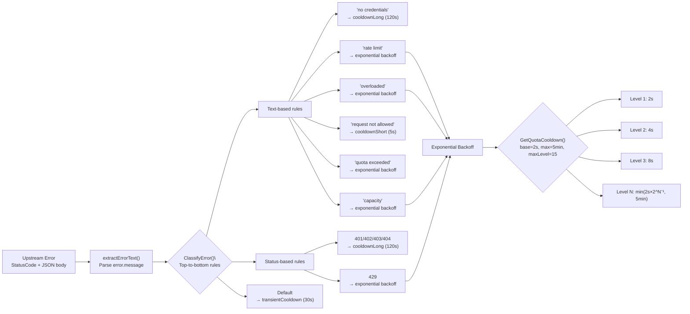
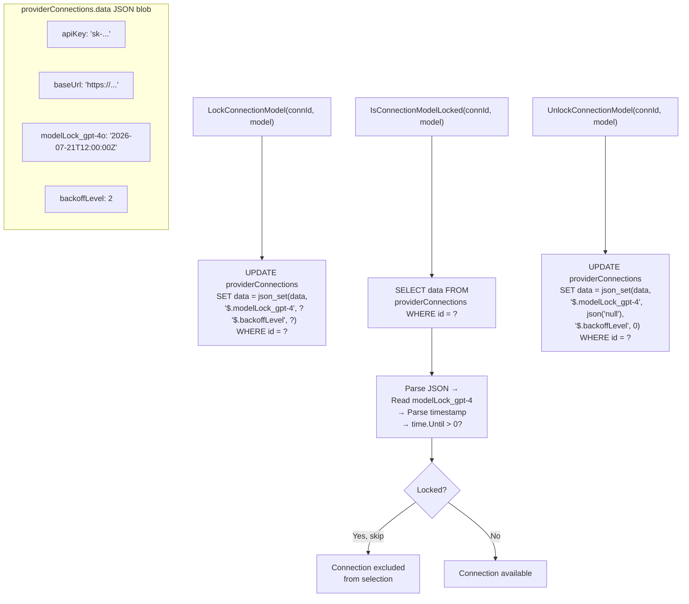
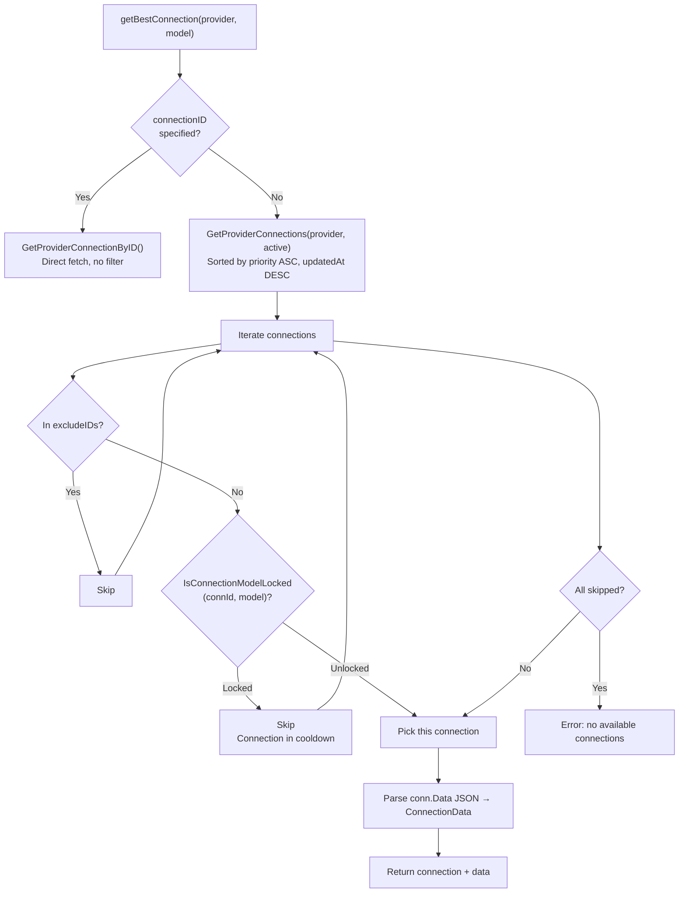
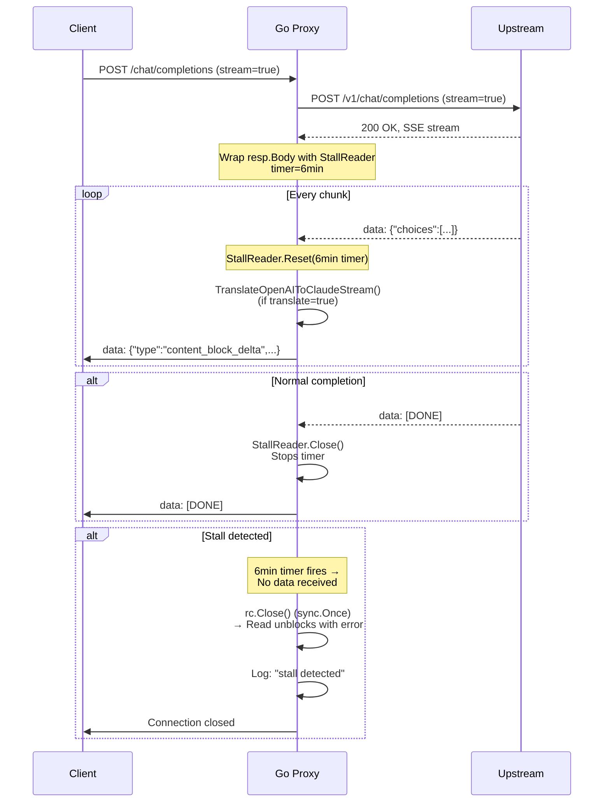
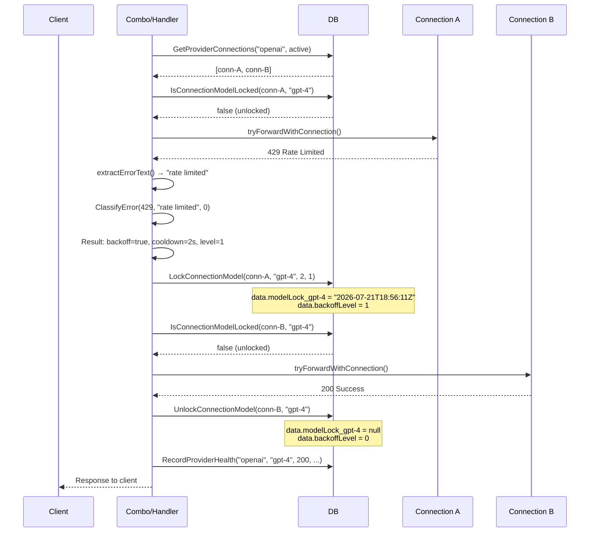
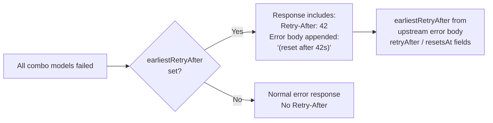
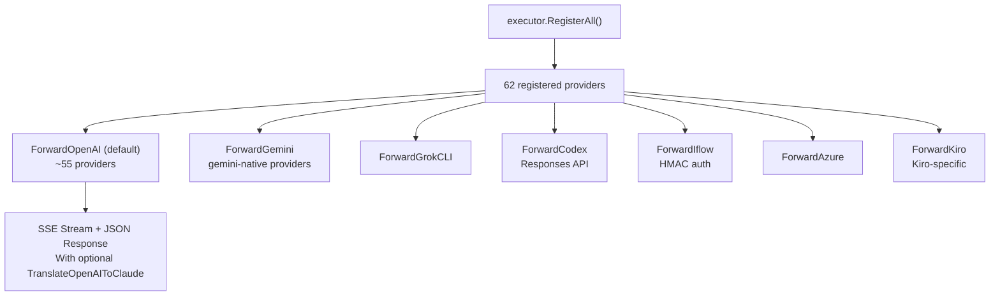

# 9Router Go Proxy — Architecture Documentation

## Request Lifecycle



## Combo Strategy Details



## Fusion Flow



## Error Classification & Backoff



## Per-Connection Locking



## Connection Selection Flow



## SSE Stream with Stall Detection



## Account Fallback with Per-Connection Locking



## Retry-After Response



## Provider Registry & Executor Dispatch



## Fusion Panel Text Extraction

```mermaid
flowchart TD
    PanelResp["Panel Response (JSON)"] --> PFormat{"Which format?"}
    PFormat -->|OpenAI Chat| OC["choices[0].message.content"]
    PFormat -->|Claude| CR["json.content (text blocks)"]
    PFormat -->|Gemini| GR["candidates[0].content.parts[*].text"]
    PFormat -->|Responses API| RES["output[*].content[*].text"]
    
    OC --> Text["extractTextContent()"]
    CR --> Text
    GR --> Text
    RES --> Text
    
    Text --> Judge["Judge model synthesizes\nfinal answer"]

## Safety, Thread-Safety & Concurrency (v1.4.0)

```mermaid
flowchart TD
    Req["HTTP Request"] --> MaxBody["middleware.MaxBody(10MB)\nMaxBytesReader OOM Guard"]
    MaxBody --> CtxUsage["translator.WithUsageCapture(ctx)\nContext-Isolated Usage Storage"]
    CtxUsage --> CommitW["committedResponseWriter(w)\nTrack header writes via IsCommitted()"]
    
    CommitW --> PoolCache["proxyPoolCache (sync.Map)\nThread-safe Round-Robin Index"]
    CommitW --> DailyMu["upsertDailyUsage()\nProtected by dailyUsageMu Mutex"]
    
    CommitW --> Shutdown["http.Server Graceful Shutdown\n15-second drain timeout on SIGINT/SIGTERM"]
```

- **Context-based Usage Capture**: Replaced global `translator.lastUsage` with context-captured isolation (`WithUsageCapture`, `SetUsage`, `GetAndClearUsage`) to eliminate cross-request data races.
- **Committed Response Writer**: `committedResponseWriter` tracks header writes (`IsCommitted()`), ensuring fallback retries are aborted if SSE streaming has already started.
- **Request Body Guard**: `middleware.MaxBody(10MB)` wraps `r.Body` with `http.MaxBytesReader` to protect endpoints against OOM exhaustion attacks.
- **Thread-safe ProxyPool Cache**: `proxyPoolCache` (`sync.Map`) caches pool instances so round-robin counters rotate properly across concurrent requests.
- **Graceful Shutdown**: `cmd/9router-go/main.go` runs `http.Server` with OS signal listener (SIGINT/SIGTERM) and 15-second graceful drain timeout.

```
