# 9Router Go Proxy — Architecture Documentation

> **Version sync:** `9router-go v1.8.8` ↔ `decolua/9router v0.5.65` (Next.js) — 100% engine parity, 31 commits `v0.5.59...v0.5.65`. Diagrams below are for maintainers/AI to understand the ported Go flows.

**For AI/Maintainers:** Go repo is the *engine* (proxy, SSE, translation), Next.js is the *dashboard UI* — they share `~/.9router/db/data.sqlite` (WAL). All `providerConnections.data` JSON blobs, `kv` (`modelAliases`, `customModels`), and `combos` are 1:1 compatible. Do not duplicate translation logic; check `internal/translator` first. E2E tests are in `internal/handlers/chat/*_e2e_test.go` (deterministic mocks, no real network).

## Request Lifecycle

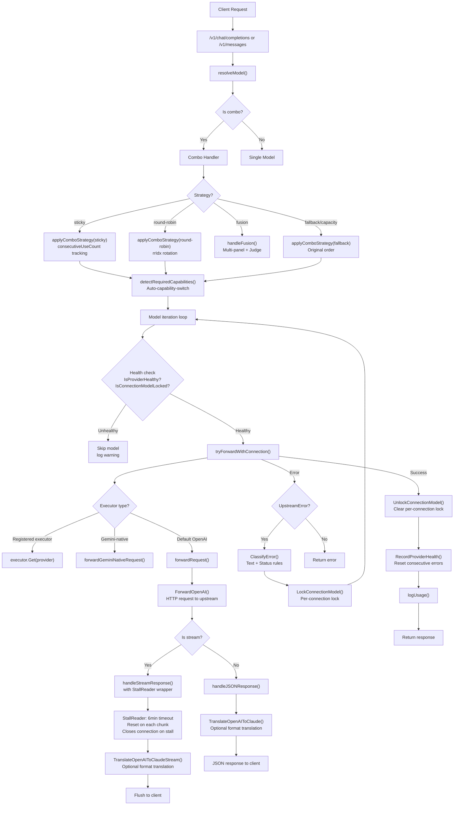
```mermaid
flowchart TD
    Client["Client Request"] --> Auth["/v1/chat/completions or /v1/messages"]
    Auth --> Resolve["resolveModel()"]
    Resolve --> IsCombo{"Is combo?"}
    IsCombo -->|Yes| Combo["Combo Handler"]
    IsCombo -->|No| Single["Single Model"]
    
    Combo --> Strategy{"Strategy?"}
    Strategy -->|sticky| Sticky["applyComboStrategy(sticky)\nconsecutiveUseCount tracking"]
    Strategy -->|round-robin| RR["applyComboStrategy(round-robin)\nrrIdx rotation"]
    Strategy -->|fusion| Fusion["handleFusion()\nMulti-panel + Judge"]
    Strategy -->|fallback/capacity| Default["applyComboStrategy(fallback)\nOriginal order"]
    
    Sticky --> CapSwitch
    RR --> CapSwitch
    Default --> CapSwitch
    
    CapSwitch["detectRequiredCapabilities()\nAuto-capability-switch"]
    CapSwitch --> ModelLoop["Model iteration loop"]
    
    ModelLoop --> HealthCheck{"Health check\nIsProviderHealthy?\nIsConnectionModelLocked?"}
    HealthCheck -->|Unhealthy| Skip["Skip model\nlog warning"]
    HealthCheck -->|Healthy| Try["tryForwardWithConnection()"]
    
    Try --> ExecSelect{"Executor type?"}
    ExecSelect -->|Registered executor| Exec["executor.Get(provider)"]
    ExecSelect -->|Gemini-native| Gemini["forwardGeminiNativeRequest()"]
    ExecSelect -->|Default OpenAI| Fwd["forwardRequest()"]
    
    Fwd --> FWResp["ForwardOpenAI()\nHTTP request to upstream"]
    FWResp --> IsStream{"Is stream?"}
    IsStream -->|Yes| SSE["handleStreamResponse()\nwith StallReader wrapper"]
    IsStream -->|No| JSON["handleJSONResponse()"]
    SSE --> Stall["StallReader: 6min timeout\nReset on each chunk\nCloses connection on stall"]
    Stall --> Trans["TranslateOpenAIToClaudeStream()\nOptional format translation"]
    Trans --> Flush["Flush to client"]
    
    JSON --> JTrans["TranslateOpenAIToClaude()\nOptional format translation"]
    JTrans --> JResp["JSON response to client"]
    
    Try -->|Error| ErrHandler{"UpstreamError?"}
    ErrHandler -->|Yes| Classify["ClassifyError()\nText + Status rules"]
    Classify --> LockConn["LockConnectionModel()\nPer-connection lock"]
    LockConn --> ModelLoop
    
    ErrHandler -->|No| ReturnErr["Return error"]
    
    Try -->|Success| Unlock["UnlockConnectionModel()\nClear per-connection lock"]
    Unlock --> HealthRec["RecordProviderHealth()\nReset consecutive errors"]
    HealthRec --> Log["logUsage()"]
    Log --> ReturnOK["Return response"]
```

## Combo Strategy Details

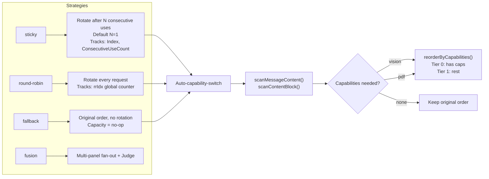
```mermaid
flowchart LR
    subgraph Strategies
        direction LR
        S1[sticky] --> S1D["Rotate after N consecutive uses\nDefault N=1\nTracks: Index, ConsecutiveUseCount"]
        S2[round-robin] --> S2D["Rotate every request\nTracks: rrIdx global counter"]
        S3[fallback] --> S3D["Original order, no rotation\nCapacity = no-op"]
        S4[fusion] --> S4D["Multi-panel fan-out + Judge"]
    end
    
    S1D --> AS["Auto-capability-switch"]
    S2D --> AS
    S3D --> AS
    
    AS --> Detect["scanMessageContent()\nscanContentBlock()"]
    Detect --> Caps{"Capabilities needed?"}
    Caps -->|vision| Reorder["reorderByCapabilities()\nTier 0: has caps\nTier 1: rest"]
    Caps -->|pdf| Reorder
    Caps -->|none| Keep["Keep original order"]
```

## Fusion Flow

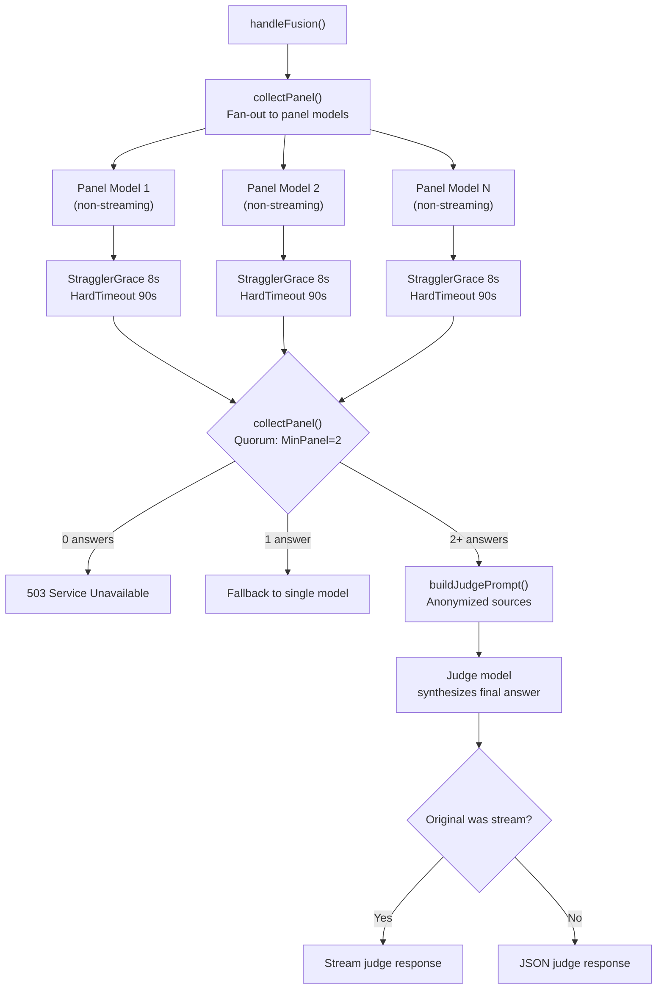
```mermaid
flowchart TD
    Fusion["handleFusion()"] --> Panel["collectPanel()\nFan-out to panel models"]
    Panel --> P1["Panel Model 1\n(non-streaming)"]
    Panel --> P2["Panel Model 2\n(non-streaming)"]
    Panel --> PN["Panel Model N\n(non-streaming)"]
    
    P1 --> T1["StragglerGrace 8s\nHardTimeout 90s"]
    P2 --> T2["StragglerGrace 8s\nHardTimeout 90s"]
    PN --> TN["StragglerGrace 8s\nHardTimeout 90s"]
    
    T1 --> Collect{"collectPanel()\nQuorum: MinPanel=2"}
    T2 --> Collect
    TN --> Collect
    
    Collect -->|0 answers| Degrade0["503 Service Unavailable"]
    Collect -->|1 answer| Degrade1["Fallback to single model"]
    Collect -->|2+ answers| Judge
    
    Judge["buildJudgePrompt()\nAnonymized sources"] --> JudgeReq["Judge model\nsynthesizes final answer"]
    JudgeReq --> JudgeStream{"Original was stream?"}
    JudgeStream -->|Yes| JudgeSSE["Stream judge response"]
    JudgeStream -->|No| JudgeJSON["JSON judge response"]
```

## Error Classification & Backoff

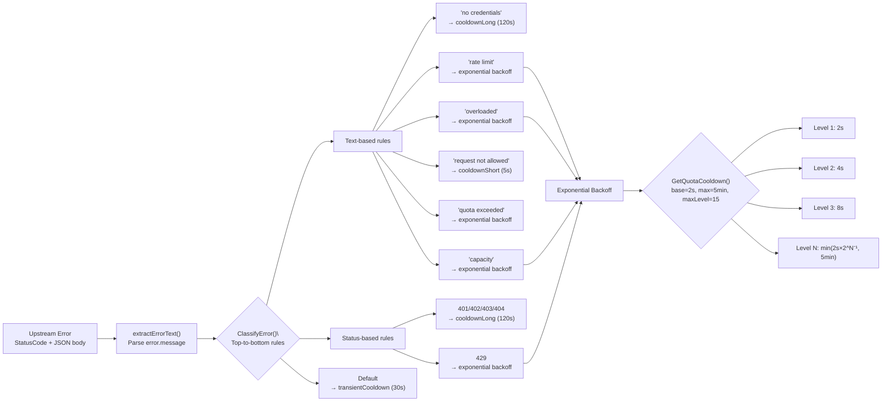
```mermaid
flowchart LR
    Error["Upstream Error\nStatusCode + JSON body"] --> Extract["extractErrorText()\nParse error.message"]
    Extract --> Classify{"ClassifyError()\
    Top-to-bottom rules"}
    
    Classify --> TextRules["Text-based rules"]
    TextRules --> TR1["'no credentials'\n→ cooldownLong (120s)"]
    TextRules --> TR2["'rate limit'\n→ exponential backoff"]
    TextRules --> TR3["'overloaded'\n→ exponential backoff"]
    TextRules --> TR4["'request not allowed'\n→ cooldownShort (5s)"]
    TextRules --> TR5["'quota exceeded'\n→ exponential backoff"]
    TextRules --> TR6["'capacity'\n→ exponential backoff"]
    
    Classify --> StatusRules["Status-based rules"]
    StatusRules --> SR1["401/402/403/404\n→ cooldownLong (120s)"]
    StatusRules --> SR2["429\n→ exponential backoff"]
    
    Classify --> Default["Default\n→ transientCooldown (30s)"]
    
    TR2 --> Backoff["Exponential Backoff"]
    TR3 --> Backoff
    TR6 --> Backoff
    SR2 --> Backoff
    
    Backoff --> BCalc{"GetQuotaCooldown()\nbase=2s, max=5min, maxLevel=15"}
    BCalc --> B1["Level 1: 2s"]
    BCalc --> B2["Level 2: 4s"]
    BCalc --> B3["Level 3: 8s"]
    BCalc --> BN["Level N: min(2s×2^N⁻¹, 5min)"]
```

## Per-Connection Locking

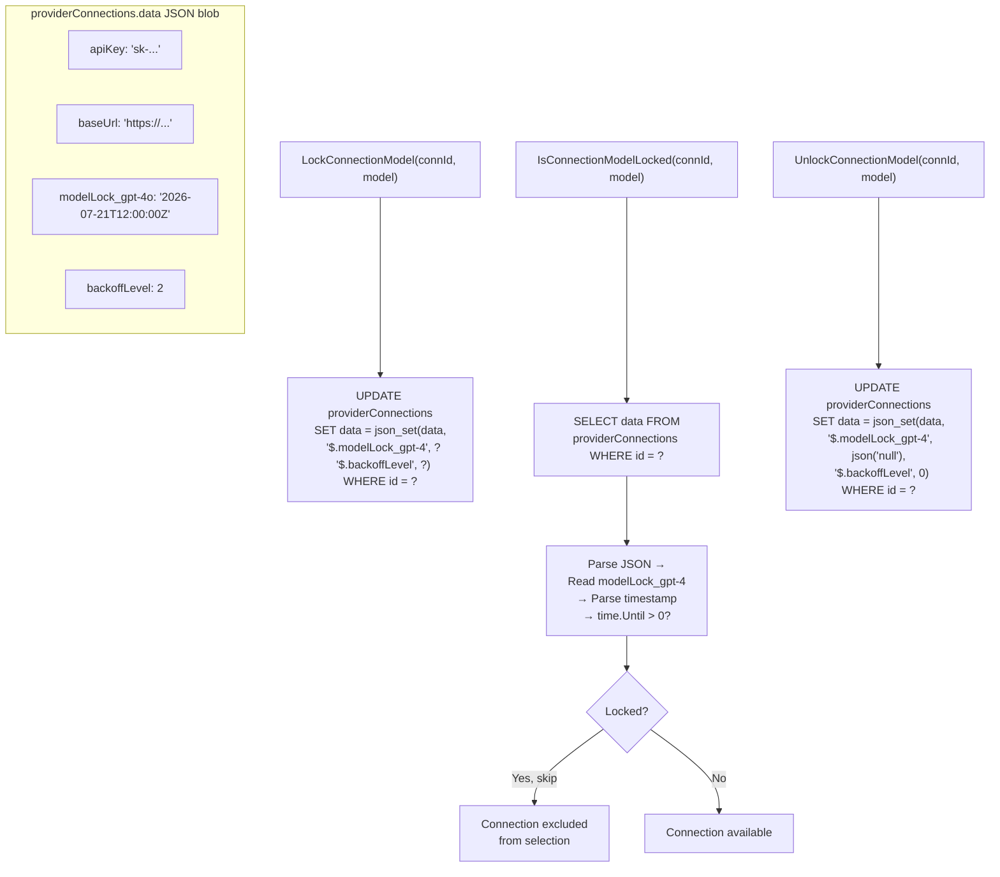
```mermaid
flowchart TD
    subgraph Storage["providerConnections.data JSON blob"]
        direction LR
        F1["apiKey: 'sk-...'"] 
        F2["baseUrl: 'https://...'"]
        F3["modelLock_gpt-4o: '2026-07-21T12:00:00Z'"]
        F4["backoffLevel: 2"]
    end

    Lock["LockConnectionModel(connId, model)"] --> SQL1["UPDATE providerConnections\nSET data = json_set(data,\n  '$.modelLock_gpt-4', ?\n  '$.backoffLevel', ?)\nWHERE id = ?"]
    
    Check["IsConnectionModelLocked(connId, model)"] --> SQL2["SELECT data FROM\nproviderConnections WHERE id = ?"]
    SQL2 --> Parse["Parse JSON →\nRead modelLock_gpt-4\n→ Parse timestamp\n→ time.Until > 0?"]
    Parse --> Result{"Locked?"}
    Result -->|Yes, skip| Skipped["Connection excluded\nfrom selection"]
    Result -->|No| Tryable["Connection available"]

    Unlock["UnlockConnectionModel(connId, model)"] --> SQL3["UPDATE providerConnections\nSET data = json_set(data,\n  '$.modelLock_gpt-4', json('null'),\n  '$.backoffLevel', 0)\nWHERE id = ?"]
```

## Connection Selection Flow

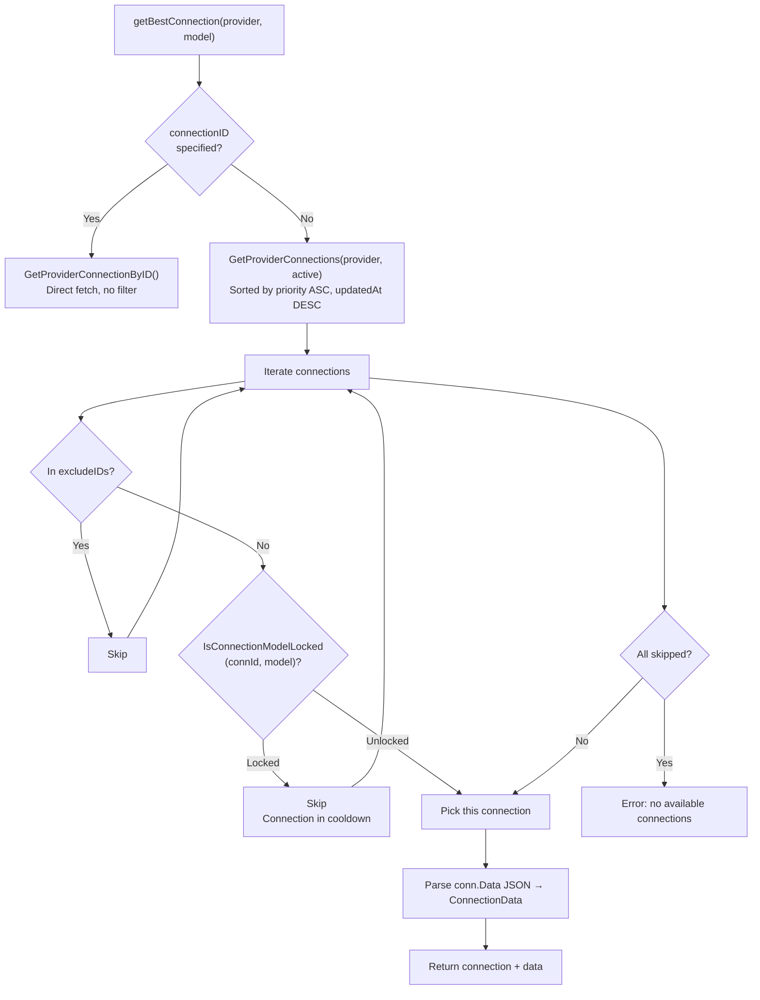
```mermaid
flowchart TD
    Select["getBestConnection(provider, model)"] --> Pin{"connectionID\nspecified?"}
    Pin -->|Yes| Direct["GetProviderConnectionByID()\nDirect fetch, no filter"]
    Pin -->|No| List["GetProviderConnections(provider, active)\nSorted by priority ASC, updatedAt DESC"]
    
    List --> Iter["Iterate connections"]
    Iter --> Excl{"In excludeIDs?"}
    Excl -->|Yes| Skip1["Skip"]
    Excl -->|No| LockCheck{"IsConnectionModelLocked\n(connId, model)?"}
    LockCheck -->|Locked| Skip2["Skip\nConnection in cooldown"]
    LockCheck -->|Unlocked| Pick["Pick this connection"]
    
    Pick --> Parse["Parse conn.Data JSON → ConnectionData"]
    Parse --> Return["Return connection + data"]
    
    Skip1 --> Iter
    Skip2 --> Iter
    
    Iter --> AllSkipped{"All skipped?"}
    AllSkipped -->|Yes| Error["Error: no available connections"]
    AllSkipped -->|No| Pick
```

## SSE Stream with Stall Detection

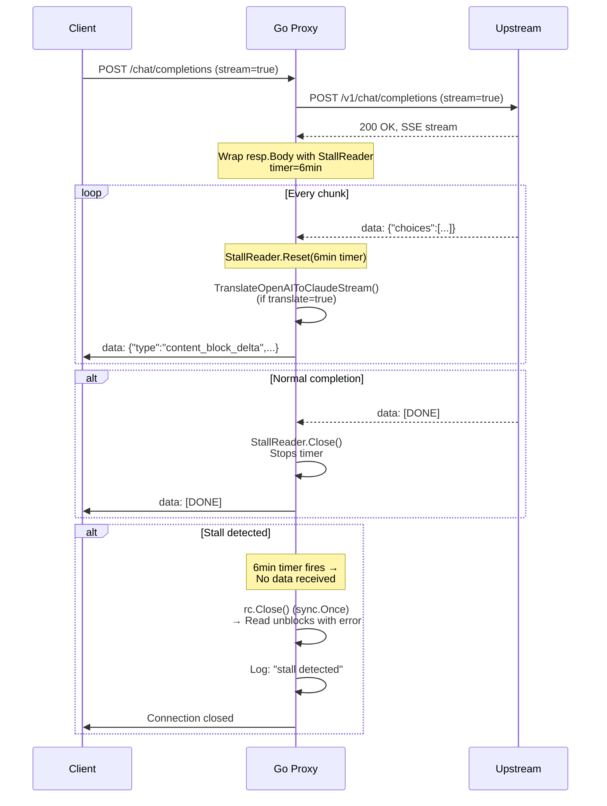
```mermaid
sequenceDiagram
    participant C as Client
    participant G as Go Proxy
    participant U as Upstream
    
    C->>G: POST /chat/completions (stream=true)
    G->>U: POST /v1/chat/completions (stream=true)
    U-->>G: 200 OK, SSE stream
    
    Note over G: Wrap resp.Body with StallReader<br/>timer=6min
    
    loop Every chunk
        U-->>G: data: {"choices":[...]}
        Note over G: StallReader.Reset(6min timer)
        G->>G: TranslateOpenAIToClaudeStream()<br/>(if translate=true)
        G->>C: data: {"type":"content_block_delta",...}
    end
    
    alt Normal completion
        U-->>G: data: [DONE]
        G->>G: StallReader.Close()<br/>Stops timer
        G->>C: data: [DONE]
    end
    
    alt Stall detected
        Note over G: 6min timer fires →<br/>No data received
        G->>G: rc.Close() (sync.Once)<br/>→ Read unblocks with error
        G->>G: Log: "stall detected"
        G->>C: Connection closed
    end
```

## Account Fallback with Per-Connection Locking

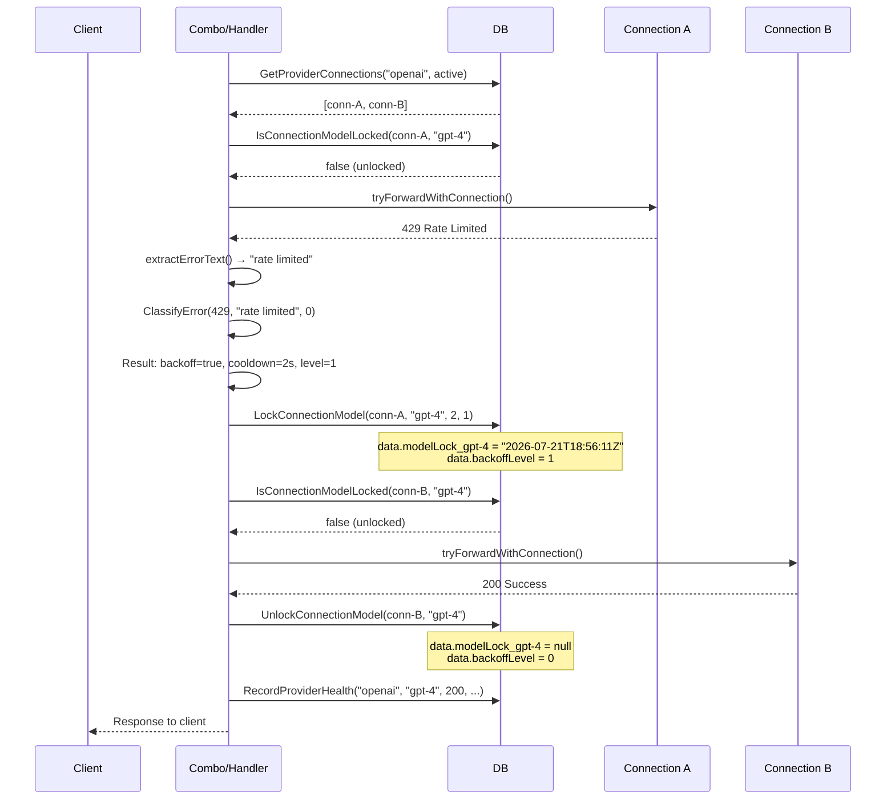
```mermaid
sequenceDiagram
    participant C as Client
    participant H as Combo/Handler
    participant D as DB
    participant A as Connection A
    participant B as Connection B
    
    H->>D: GetProviderConnections("openai", active)
    D-->>H: [conn-A, conn-B]
    
    H->>D: IsConnectionModelLocked(conn-A, "gpt-4")
    D-->>H: false (unlocked)
    H->>A: tryForwardWithConnection()
    A-->>H: 429 Rate Limited
    
    H->>H: extractErrorText() → "rate limited"
    H->>H: ClassifyError(429, "rate limited", 0)
    H->>H: Result: backoff=true, cooldown=2s, level=1
    
    H->>D: LockConnectionModel(conn-A, "gpt-4", 2, 1)
    Note over D: data.modelLock_gpt-4 = "2026-07-21T18:56:11Z"<br/>data.backoffLevel = 1
    
    H->>D: IsConnectionModelLocked(conn-B, "gpt-4")
    D-->>H: false (unlocked)
    H->>B: tryForwardWithConnection()
    B-->>H: 200 Success
    
    H->>D: UnlockConnectionModel(conn-B, "gpt-4")
    Note over D: data.modelLock_gpt-4 = null<br/>data.backoffLevel = 0
    
    H->>D: RecordProviderHealth("openai", "gpt-4", 200, ...)
    
    H-->>C: Response to client
```

## Retry-After Response

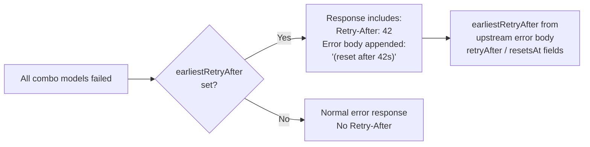
```mermaid
flowchart LR
    AllFail["All combo models failed"] --> RACheck{"earliestRetryAfter\nset?"}
    RACheck -->|Yes| RAHeader["Response includes:\nRetry-After: 42\nError body appended:\n'(reset after 42s)'"]
    RACheck -->|No| NormalError["Normal error response\nNo Retry-After"]
    
    RAHeader --> Source["earliestRetryAfter from\nupstream error body\nretryAfter / resetsAt fields"]
```

## Provider Registry & Executor Dispatch

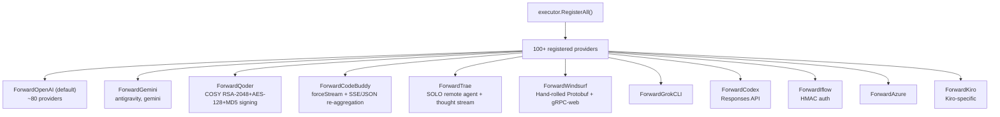
```mermaid
flowchart TD
    Registry["executor.RegisterAll()"] --> Prov["100+ registered providers"]
    Prov --> OpenAI["ForwardOpenAI (default)\n~80 providers"]
    Prov --> Gemini["ForwardGemini\nantigravity, gemini"]
    Prov --> Qoder["ForwardQoder\nCOSY RSA-2048+AES-128+MD5 signing"]
    Prov --> CodeBuddy["ForwardCodeBuddy\nforceStream + SSE/JSON re-aggregation"]
    Prov --> Trae["ForwardTrae\nSOLO remote agent + thought stream"]
    Prov --> Windsurf["ForwardWindsurf\nHand-rolled Protobuf + gRPC-web"]
    Prov --> GrokCLI["ForwardGrokCLI"]
    Prov --> Codex["ForwardCodex\nResponses API"]
    Prov --> Iflow["ForwardIflow\nHMAC auth"]
    Prov --> Azure["ForwardAzure"]
    Prov --> Kiro["ForwardKiro\nKiro-specific"]
```

## Antigravity Decoy & Anti-Ban Architecture

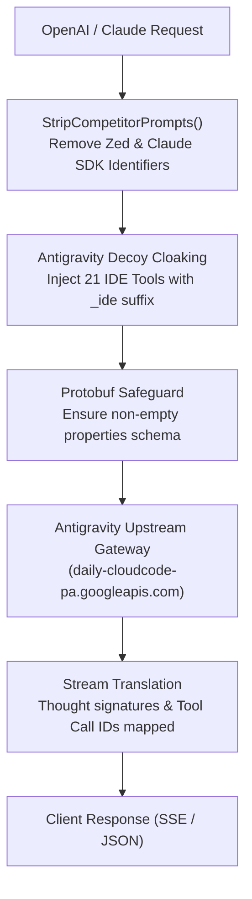
```mermaid
flowchart TD
    In["OpenAI / Claude Request"] --> Strip["StripCompetitorPrompts()\nRemove Zed & Claude SDK Identifiers"]
    Strip --> Decoy["Antigravity Decoy Cloaking\nInject 21 IDE Tools with _ide suffix"]
    Decoy --> Validate["Protobuf Safeguard\nEnsure non-empty properties schema"]
    Validate --> Upstream["Antigravity Upstream Gateway\n(daily-cloudcode-pa.googleapis.com)"]
    Upstream --> Stream["Stream Translation\nThought signatures & Tool Call IDs mapped"]
    Stream --> Client["Client Response (SSE / JSON)"]
```

## Realtime SSE Usage Stream & In-Flight Tracker

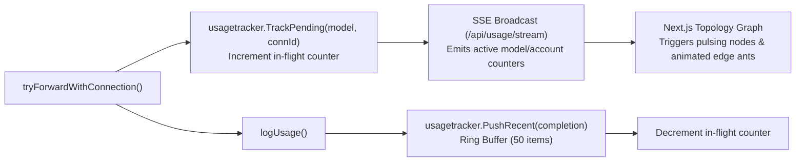
```mermaid
flowchart LR
    ReqStart["tryForwardWithConnection()"] --> Track["usagetracker.TrackPending(model, connId)\nIncrement in-flight counter"]
    Track --> SSE["SSE Broadcast (/api/usage/stream)\nEmits active model/account counters"]
    SSE --> Dash["Next.js Topology Graph\nTriggers pulsing nodes & animated edge ants"]
    ReqStart --> Finish["logUsage()"]
    Finish --> Push["usagetracker.PushRecent(completion)\nRing Buffer (50 items)"]
    Push --> TrackEnd["Decrement in-flight counter"]
```

## Custom Models with Capability Toggles (v0.5.65)

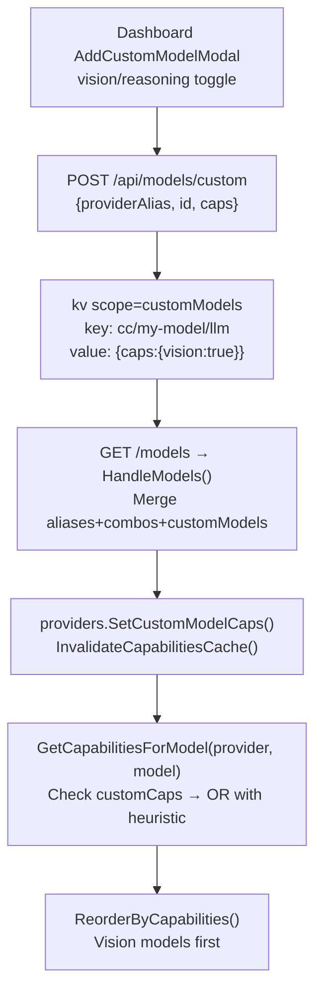
```mermaid
flowchart TD
    UI["Dashboard AddCustomModelModal\nvision/reasoning toggle"] --> API["POST /api/models/custom\n{providerAlias, id, caps}"]
    API --> KV["kv scope=customModels\nkey: cc/my-model/llm\nvalue: {caps:{vision:true}}"]
    KV --> List["GET /models → HandleModels()\nMerge aliases+combos+customModels"]
    List --> Caps["providers.SetCustomModelCaps()\nInvalidateCapabilitiesCache()"]
    Caps --> Resolve["GetCapabilitiesForModel(provider, model)\nCheck customCaps → OR with heuristic"]
    Resolve --> Combo["ReorderByCapabilities()\nVision models first"]
```

- **Upsert:** `aliasRepo.addCustomModel` in Next.js uses `SELECT value` + `UPDATE` if exists (no duplicate `INSERT`), Go reads via `Repo.GetCustomModels()` + `SetCustomModelCaps` on each `HandleModels` (live refresh, no restart needed).

## SSRF Guard Hardening (v0.5.65 #3714)

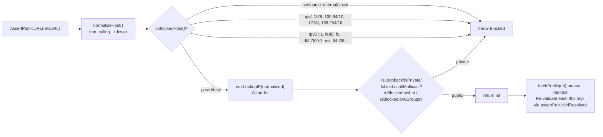
```mermaid
flowchart LR
    URL["AssertPublicURL(rawURL)"] --> Norm["normalizeHost()\ntrim trailing . + lower"]
    Norm --> BlockHost{"isBlockedHost()?"}
    BlockHost -->|hostname .internal/.local| Block["throw Blocked"]
    BlockHost -->|ipv4 10/8, 100.64/10, 127/8, 169.254/16| Block
    BlockHost -->|ipv6 ::1, fe80, fc, ::ffff:7f00:1 hex, 64:ff9b::| Block
    BlockHost -->|pass literal| DNS["net.LookupIP(normalized)\nAll addrs"]
    DNS --> CheckIP{"IsLoopback/IsPrivate/\nIsLinkLocal/Multicast?\nisBlockedIpv4Int / isBlockedIpv6Groups?"}
    CheckIP -->|private| Block
    CheckIP -->|public| Allow["return nil"]
    Allow --> Fetch["fetchPublic(url) manual redirect\nRe-validate each 30x hop via assertPublicUrlResolved"]
```

- **IPv6:** `parseIPv6ToGroups` handles `::ffff:127.0.0.1` vs `::ffff:7f00:1` (same numeric groups), `64:ff9b::`, `::` compressed.
- **Unresolvable host** → `return nil` (let `fetch` fail, not SSRF).

## Ollama Cloud Web Fetch (v0.5.65)

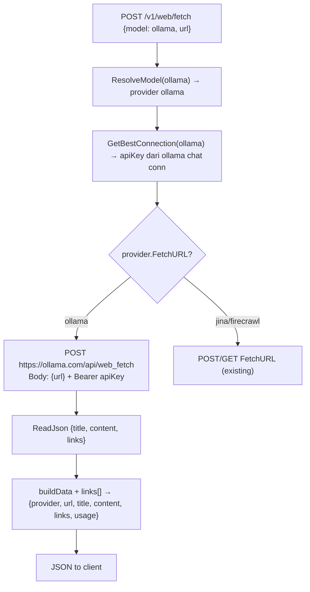
```mermaid
flowchart TD
    Client["POST /v1/web/fetch {model: ollama, url}"] --> Resolve["ResolveModel(ollama) → provider ollama"]
    Resolve --> Conn["GetBestConnection(ollama) → apiKey dari ollama chat conn"]
    Conn --> FetchURL{"provider.FetchURL?"}
    FetchURL -->|ollama| Ollama["POST https://ollama.com/api/web_fetch\nBody: {url} + Bearer apiKey"]
    FetchURL -->|jina/firecrawl| Other["POST/GET FetchURL (existing)"]
    Ollama --> Parse["ReadJson {title, content, links}"]
    Parse --> Build["buildData + links[] → {provider, url, title, content, links, usage}"]
    Build --> Resp["JSON to client"]
```

- **Scoped lock:** `webfetch:ollama` key so `429` fetch doesn't lock `LLM` (Next.js `handleFetch` uses `fetchLockKey`, Go via `media.go` `FetchURL` check).

## Groq Usage via x-ratelimit-* (v0.5.65)

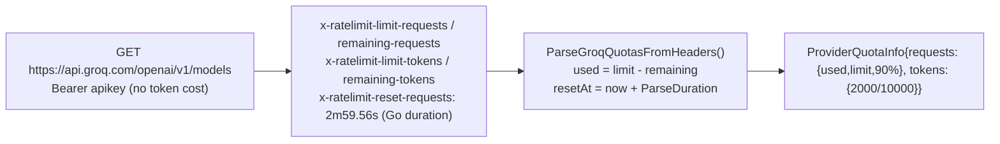
```mermaid
flowchart LR
    Req["GET https://api.groq.com/openai/v1/models\nBearer apikey (no token cost)"] --> Headers["x-ratelimit-limit-requests / remaining-requests\nx-ratelimit-limit-tokens / remaining-tokens\nx-ratelimit-reset-requests: 2m59.56s (Go duration)"]
    Headers --> Parse["ParseGroqQuotasFromHeaders()\nused = limit - remaining\nresetAt = now + ParseDuration"]
    Parse --> Quota["ProviderQuotaInfo{requests: {used,limit,90%}, tokens: {2000/10000}}"]
```

## Single Model Lookup Catch-All (v0.5.65 #3588)

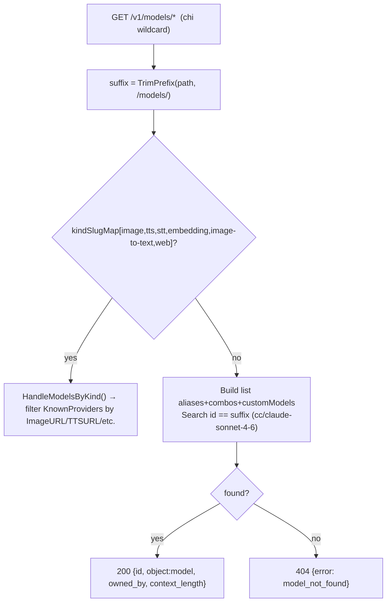
```mermaid
flowchart TD
    Path["GET /v1/models/*  (chi wildcard)"] --> Suffix["suffix = TrimPrefix(path, /models/)"]
    Suffix --> IsKind{"kindSlugMap[image,tts,stt,embedding,image-to-text,web]?"}
    IsKind -->|yes| Kind["HandleModelsByKind() → filter KnownProviders by ImageURL/TTSURL/etc."]
    IsKind -->|no| Lookup["Build list aliases+combos+customModels\nSearch id == suffix (cc/claude-sonnet-4-6)"]
    Lookup --> Found{"found?"}
    Found -->|yes| Single["200 {id, object:model, owned_by, context_length}"]
    Found -->|no| NotFound["404 {error: model_not_found}"]
```

## Opencode Muse-Spark Routing (v0.5.65 + 1.3 fix)

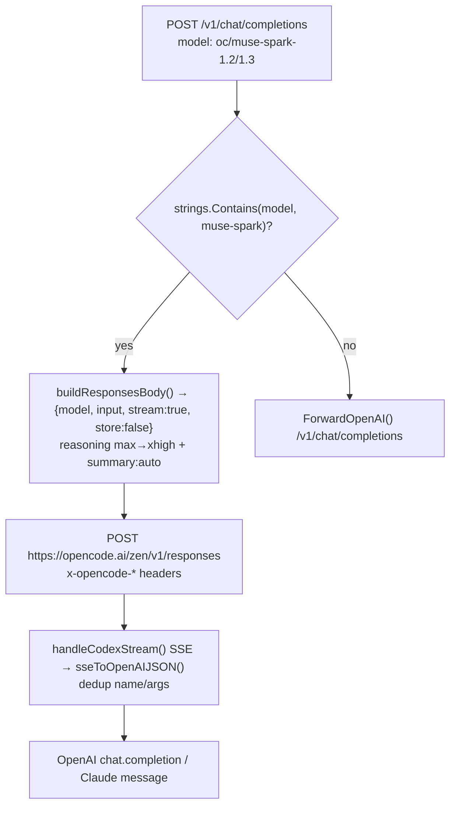
```mermaid
flowchart TD
    Req["POST /v1/chat/completions\nmodel: oc/muse-spark-1.2/1.3"] --> Check{"strings.Contains(model, muse-spark)?"}
    Check -->|yes| Build["buildResponsesBody() → {model, input, stream:true, store:false}\nreasoning max→xhigh + summary:auto"]
    Build --> Forward["POST https://opencode.ai/zen/v1/responses\nx-opencode-* headers"]
    Forward --> SSE["handleCodexStream() SSE → sseToOpenAIJSON() dedup name/args"]
    SSE --> Resp["OpenAI chat.completion / Claude message"]
    Check -->|no| OpenAI["ForwardOpenAI() /v1/chat/completions"]
```

## Safety, Thread-Safety & Concurrency (v1.8.3)

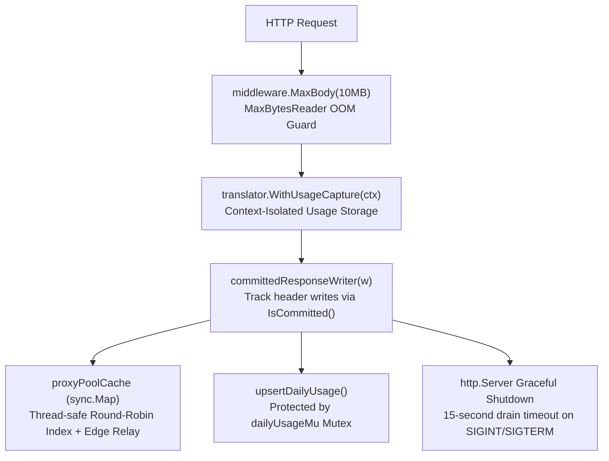
```mermaid
flowchart TD
    Req["HTTP Request"] --> MaxBody["middleware.MaxBody(10MB)\nMaxBytesReader OOM Guard"]
    MaxBody --> CtxUsage["translator.WithUsageCapture(ctx)\nContext-Isolated Usage Storage"]
    CtxUsage --> CommitW["committedResponseWriter(w)\nTrack header writes via IsCommitted()"]
    
    CommitW --> PoolCache["proxyPoolCache (sync.Map)\nThread-safe Round-Robin Index + Edge Relay"]
    CommitW --> DailyMu["upsertDailyUsage()\nProtected by dailyUsageMu Mutex"]
    
    CommitW --> Shutdown["http.Server Graceful Shutdown\n15-second drain timeout on SIGINT/SIGTERM"]
```

- **Context-based Usage Capture**: Replaced global `translator.lastUsage` with context-captured isolation (`WithUsageCapture`, `SetUsage`, `GetAndClearUsage`) to eliminate cross-request data races.
- **Committed Response Writer**: `committedResponseWriter` tracks header writes (`IsCommitted()`), ensuring fallback retries are aborted if SSE streaming has already started.
- **Request Body Guard**: `middleware.MaxBody(10MB)` wraps `r.Body` with `http.MaxBytesReader` to protect endpoints against OOM exhaustion attacks.
- **Thread-safe ProxyPool Cache & Edge Relays**: `proxyPoolCache` (`sync.Map`) caches pool instances so round-robin counters rotate properly across concurrent requests, and injects `x-relay-target` / `x-relay-path` for Vercel/Cloudflare/Deno edge relays.
- **In-Memory Request Tracker**: Thread-safe tracker with mutex-guarded active concurrency maps and subscriber channels for live SSE telemetry.
- **Graceful Shutdown**: `cmd/9router-go/main.go` runs `http.Server` with OS signal listener (SIGINT/SIGTERM) and 15-second graceful drain timeout.
