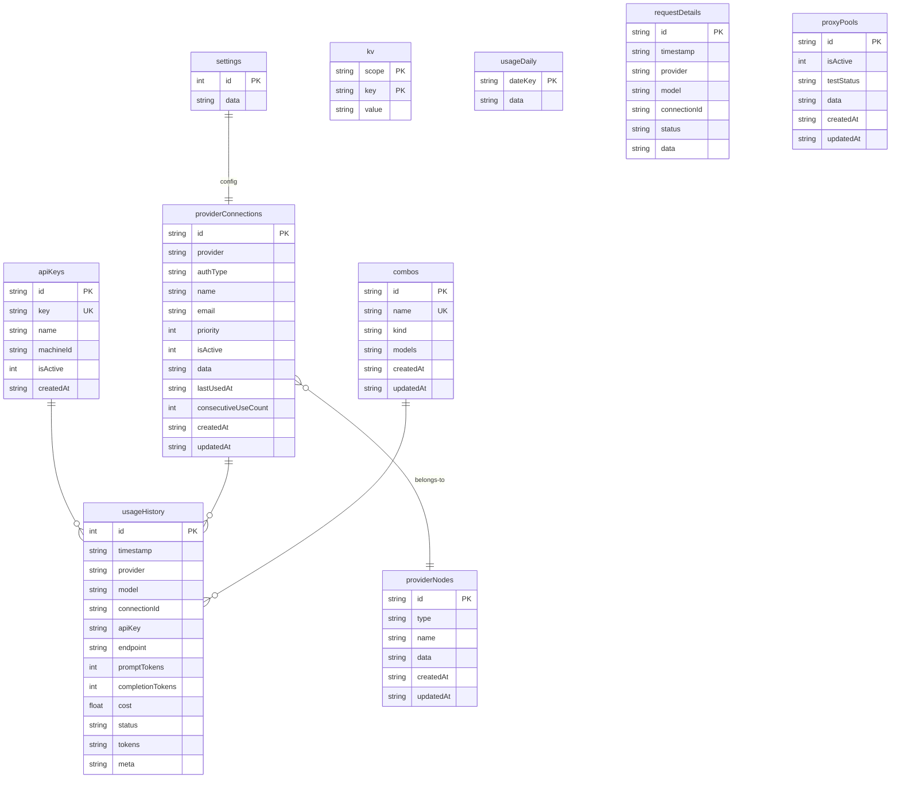
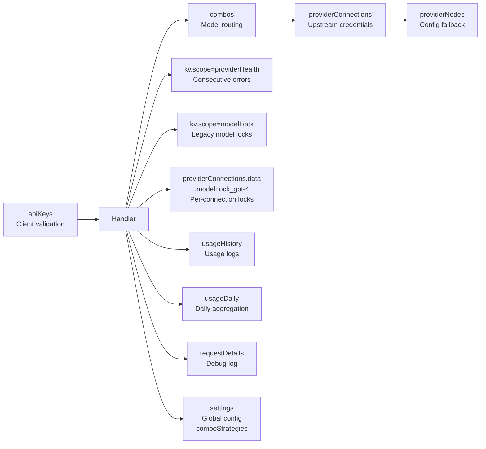

# 9Router SQLite Database Schema

Database shared antara Go proxy dan Next.js dashboard. Satu file SQLite — `9router.db`.

## Schema Versioning

Next.js pake `_meta` table buat tracking schema version (`SCHEMA_VERSION = 1`).
Go gak punya migration — schema additive (new columns di-ignore sama query lama, new tables di-create pas startup).

## Tables Overview



---

## Detail Table per Table

### 1. `providerConnections` — Inti dari Proxy

Table paling penting. Nyimpen semua koneksi ke upstream provider (API key, endpoint, dll).

```sql
CREATE TABLE providerConnections (
    id              TEXT PRIMARY KEY,            -- UUID, contoh: "conn-a1b2c3"
    provider        TEXT NOT NULL,               -- Nama provider: "openai", "deepseek", dll
    authType        TEXT NOT NULL,               -- "apikey" atau "oauth"
    name            TEXT,                        -- Nama koneksi (opsional)
    email           TEXT,                        -- Email akun (opsional)
    priority        INTEGER,                     -- Prioritas (lower = preferred)
    isActive        INTEGER DEFAULT 1,           -- 1=active, 0=inactive
    data            TEXT NOT NULL,               -- JSON blob — lihat di bawah
    lastUsedAt      TEXT,                        -- ISO timestamp (Go only)
    consecutiveUseCount INTEGER DEFAULT 0,       -- (Go only)
    createdAt       TEXT NOT NULL,               -- ISO timestamp
    updatedAt       TEXT NOT NULL                -- ISO timestamp
);
```

**Indexes:**
```sql
CREATE INDEX idx_pc_provider ON providerConnections(provider);
CREATE INDEX idx_pc_provider_active ON providerConnections(provider, isActive);
CREATE INDEX idx_pc_priority ON providerConnections(provider, priority);
```

#### `data` JSON Blob — Struktur Lengkap

Ini field yang paling dinamis — nyimpen semua data yang gak masuk column tetap.

```json
{
  "apiKey": "sk-...",
  "accessToken": "...",
  "refreshToken": "...",
  "expiresAt": "2026-12-31T23:59:59Z",
  "tokenType": "Bearer",
  "scope": "read write",
  "baseUrl": "https://api.openai.com/v1",
  "projectId": "projects/123",

  "displayName": "My OpenAI Key",
  "globalPriority": 0,
  "defaultModel": "gpt-4o",

  "testStatus": "active",
  "lastTested": "2026-07-20T12:00:00Z",
  "lastError": "Rate limited",
  "lastErrorAt": "2026-07-20T12:00:00Z",
  "errorCode": 429,

  "backoffLevel": 2,
  "rateLimitedUntil": "2026-07-20T12:05:00Z",

  "modelLock_gpt-4o": "2026-07-21T12:00:00Z",
  "modelLock_claude-sonnet": null,

  "providerSpecificData": {
    "organization": "org-xxx",
    "vertexProject": "my-project"
  }
}
```

**Key fields yang penting:**

| Field | Type | Deskripsi |
|-------|------|-----------|
| `apiKey` | string | API key utama |
| `accessToken` | string | OAuth access token |
| `baseUrl` | string | Custom base URL override |
| `backoffLevel` | int | Tingkat exponential backoff (0-15) |
| `rateLimitedUntil` | ISO string | Account-level cooldown expiry |
| `modelLock_<model>` | ISO string \| null | Per-connection model lock — **format sama antara Go & Next.js** |
| `testStatus` | string | `"active"`, `"unavailable"`, etc |

---

### 2. `kv` — Key-Value Store Serbaguna

```sql
CREATE TABLE kv (
    scope TEXT NOT NULL,      -- Namespace
    key   TEXT NOT NULL,      -- Key dalam scope
    value TEXT NOT NULL,      -- JSON value
    PRIMARY KEY (scope, key)
);
```

**Index:**
```sql
CREATE INDEX idx_kv_scope ON kv(scope);
```

**Scopes yang dipake:**

| Scope | Key Format | Value | Kegunaan |
|-------|-----------|-------|----------|
| `modelLock` | `PROVIDER/MODEL` | `{"lockedUntil":"...","lastError":"...","errorCode":429,"backoffLevel":2}` | **Legacy** global model lock (diganti per-connection) |
| `providerHealth` | `provider/model` | `{"lastStatus":429,"lastLatencyMs":1234,"lastChecked":"...","consecutiveErrors":3,"consecutiveSuccesses":0}` | Health tracking untuk consecutive error counter |
| `modelAliases` | alias name | `"openai/gpt-4o"` | Alias model name → provider/model |

---

### 3. `combos` — Model Routing Config

```sql
CREATE TABLE combos (
    id         TEXT PRIMARY KEY,
    name       TEXT UNIQUE NOT NULL,    -- Contoh: "free-tier", "pro-models"
    kind       TEXT,                    -- Opsional
    models     TEXT NOT NULL,           -- JSON array: ["openai/gpt-4o", "anthropic/claude-sonnet-4"]
    createdAt  TEXT NOT NULL,
    updatedAt  TEXT NOT NULL
);
```

**Index:**
```sql
CREATE INDEX idx_combo_name ON combos(name);
```

> **Catatan:** Column `strategy` gak ada di schema asli. Go nge-handle dengan fallback:
> 1. Default: `"fallback"`
> 2. Coba `SELECT strategy FROM combos` — kalo column ada, pake value-nya
>
> Strategy bisa di-set per-combo lewat settings (Next.js) atau DB langsung.

---

### 4. `apiKeys` — Client Auth

```sql
CREATE TABLE apiKeys (
    id        TEXT PRIMARY KEY,
    key       TEXT UNIQUE NOT NULL,    -- API key client (bisa digenerate)
    name      TEXT,
    machineId TEXT,                    -- Opsional: bind ke machine tertentu
    isActive  INTEGER DEFAULT 1,       -- 1=active, 0=disabled
    createdAt TEXT NOT NULL
);
```

**Index:**
```sql
CREATE INDEX idx_ak_key ON apiKeys(key);
```

Digunakan untuk validasi request masuk: `SELECT isActive FROM apiKeys WHERE key = ?`.

---

### 5. `providerNodes` — Provider Configuration

```sql
CREATE TABLE providerNodes (
    id        TEXT PRIMARY KEY,        -- Nama provider: "openai", "deepseek", dll
    type      TEXT,                    -- "root", "executor", dll
    name      TEXT,
    data      TEXT NOT NULL,           -- JSON: {"baseUrl":"...","authType":"bearer",...}
    createdAt TEXT NOT NULL,
    updatedAt TEXT NOT NULL
);
```

**Index:**
```sql
CREATE INDEX idx_pn_type ON providerNodes(type);
```

Digunakan sebagai fallback konfigurasi provider — kalau provider gak ada di `KnownProviders` (hardcoded di Go), bakal cek `providerNodes`.

---

### 6. `settings` — Global Config

```sql
CREATE TABLE settings (
    id   INTEGER PRIMARY KEY CHECK (id = 1),   -- Cuma 1 row
    data TEXT NOT NULL                           -- JSON blob semua settings
);
```

Contoh isi `data`:
```json
{
  "comboStrategies": {
    "free-tier": { "strategy": "round-robin", "stickyLimit": 3 },
    "pro-models": { "strategy": "fusion" }
  },
  "fusionTuning": {
    "pro-models": { "minPanel": 3, "stragglerGraceMs": 5000 }
  }
}
```

---

### 7. `usageHistory` — Log Pemakaian

```sql
CREATE TABLE usageHistory (
    id               INTEGER PRIMARY KEY AUTOINCREMENT,   -- Next.js: autoincrement
    timestamp        TEXT NOT NULL,                        -- ISO timestamp
    provider         TEXT,
    model            TEXT,
    connectionId     TEXT,
    apiKey           TEXT,
    endpoint         TEXT,
    promptTokens     INTEGER DEFAULT 0,
    completionTokens INTEGER DEFAULT 0,
    cost             REAL DEFAULT 0,
    status           TEXT,                                 -- "success", "error", dll
    tokens           TEXT,                                 -- JSON metadata pricing/raw
    meta             TEXT                                  -- JSON extra metadata
);
```

**Indexes:**
```sql
CREATE INDEX idx_uh_ts ON usageHistory(timestamp DESC);
CREATE INDEX idx_uh_provider ON usageHistory(provider);
CREATE INDEX idx_uh_model ON usageHistory(model);
CREATE INDEX idx_uh_conn ON usageHistory(connectionId);
```

> **Catatan:** Go punya `id` column cuma di Next.js schema (AUTOINCREMENT). Go version pake `rowid` implicit.

---

### 8. `usageDaily` — Aggregasi Harian

```sql
CREATE TABLE usageDaily (
    dateKey TEXT PRIMARY KEY,     -- Format: "2026-07-21"
    data    TEXT NOT NULL         -- JSON: {"totalTokens":15000,"totalCost":0.75,...}
);
```

---

### 9. `requestDetails` — Request/Response Log

```sql
CREATE TABLE requestDetails (
    id          TEXT PRIMARY KEY,     -- UUID
    timestamp   TEXT NOT NULL,
    provider    TEXT,
    model       TEXT,
    connectionId TEXT,
    status      TEXT,
    data        TEXT NOT NULL         -- JSON: {request, response, latency}
);
```

**Indexes:**
```sql
CREATE INDEX idx_rd_ts ON requestDetails(timestamp DESC);
CREATE INDEX idx_rd_provider ON requestDetails(provider);
CREATE INDEX idx_rd_model ON requestDetails(model);
CREATE INDEX idx_rd_conn ON requestDetails(connectionId);
```

Digunakan buat debugging — nyimpen raw request/response + timing.

---

### 10. `proxyPools` — Proxy Configuration

```sql
CREATE TABLE proxyPools (
    id         TEXT PRIMARY KEY,
    isActive   INTEGER DEFAULT 1,
    testStatus TEXT,                 -- "active", "failed", dll
    data       TEXT NOT NULL,        -- JSON: proxy credentials, URL, dll
    createdAt  TEXT NOT NULL,
    updatedAt  TEXT NOT NULL
);
```

**Indexes:**
```sql
CREATE INDEX idx_pp_active ON proxyPools(isActive);
CREATE INDEX idx_pp_status ON proxyPools(testStatus);
```

---

### 11. `_meta` — Schema Version (Next.js only)

```sql
CREATE TABLE _meta (
    key   TEXT PRIMARY KEY,
    value TEXT NOT NULL
);
```

Next.js pake ini buat nge-track `SCHEMA_VERSION`. Go gak pake — schema additive.

---

## Flow Data Antar Table



## Key Differences Go vs Next.js

| Aspek | Go | Next.js |
|-------|-----|---------|
| **`_meta` table** | ❌ Gak ada | ✅ Ada — tracking schema version, migration |
| **providerConnections** | Punya `lastUsedAt`, `consecutiveUseCount` sebagai **real column** | Field yang sama disimpen di **JSON `data` blob** |
| **providerConnections indexes** | ❌ Gak ada | ✅ `idx_pc_provider`, `idx_pc_provider_active`, `idx_pc_priority` |
| **combos** | Default strategy "fallback", coba `SELECT strategy` optional | Strategy dari settings, gak ada column strategy |
| **usageHistory** | ❌ Gak ada `id` column | ✅ `id INTEGER PRIMARY KEY AUTOINCREMENT` |
| **usageHistory indexes** | ❌ Gak ada | ✅ 4 indexes (timestamp, provider, model, connectionId) |
| **requestDetails** | `data TEXT` (nullable) | `data TEXT NOT NULL` |
| **requestDetails indexes** | ❌ Gak ada | ✅ 4 indexes |
| **proxyPools** | Minimal: `id`, `data`, `isActive` | Full: `id`, `isActive`, `testStatus`, `data`, `createdAt`, `updatedAt` |
| **kv indexes** | ❌ Cuma PK(scope,key) | ✅ Plus `idx_kv_scope` |
| **kv scopes tambahan** | `modelLock`, `providerHealth`, `modelAliases` | Sama + `pricing`, `customModels`, `mitmAlias`, `disabledModels` |
| **Schema migration** | ❌ Gak ada — `CREATE TABLE IF NOT EXISTS` doang | ✅ `_meta` table, auto-sync, versioning, backup |
| **Index total** | **0** (cuma PK implicit) | **18 indexes** |

> **Catatan:** Karena sharing DB, idealnya Go dan Next.js pake schema yang sama.
> Saat ini ada beberapa **drift** — terutama `usageHistory.id` (Go gak punya column id,
> jadinya INSERT dari Go bakal fail di Next.js schema yang expects AUTOINCREMENT).
> Dan `providerConnections.lastUsedAt`/`consecutiveUseCount` — Go simpen di column,
> Next.js di JSON blob. Kalo mereka sharing DB, data bisa gak konsisten.
