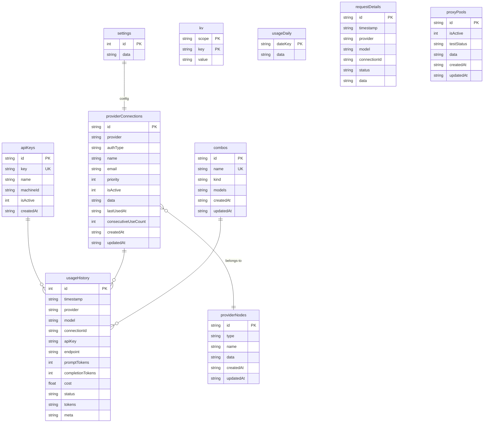
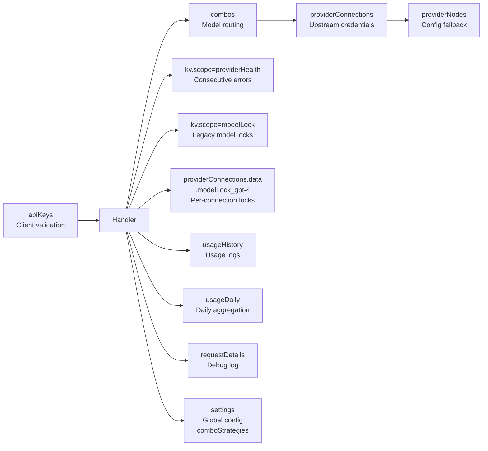

# 9Router SQLite Database Schema

Shared database between the Go proxy and the Next.js dashboard. Single SQLite file — `9router.db`.

## Schema Versioning

Next.js uses the `_meta` table to track the schema version (`SCHEMA_VERSION = 1`).
Go has no migration system — schema is additive (new columns are ignored by old queries, new tables are created with `CREATE TABLE IF NOT EXISTS`).

## Tables Overview



---

## Per-Table Details

### 1. `providerConnections` — Core Proxy Table

The most important table. Stores all upstream provider connections (API keys, endpoints, etc.).

```sql
CREATE TABLE providerConnections (
    id              TEXT PRIMARY KEY,            -- UUID, e.g. "conn-a1b2c3"
    provider        TEXT NOT NULL,               -- Provider name: "openai", "deepseek", etc
    authType        TEXT NOT NULL,               -- "apikey" or "oauth"
    name            TEXT,                        -- Connection display name (optional)
    email           TEXT,                        -- Account email (optional)
    priority        INTEGER,                     -- Priority (lower = preferred)
    isActive        INTEGER DEFAULT 1,           -- 1=active, 0=inactive
    data            TEXT NOT NULL,               -- JSON blob — see below
    lastUsedAt      TEXT,                        -- ISO timestamp (Go specific)
    consecutiveUseCount INTEGER DEFAULT 0,       -- (Go specific)
    createdAt       TEXT NOT NULL,               -- ISO timestamp
    updatedAt       TEXT NOT NULL                -- ISO timestamp
);
```

**Indexes:**
```sql
CREATE INDEX idx_pc_provider ON providerConnections(provider);
CREATE INDEX idx_pc_provider_active ON providerConnections(provider, isActive);
CREATE INDEX idx_pc_priority ON providerConnections(provider, priority);
```

#### `data` JSON Blob — Full Structure

This is the most dynamic field — stores everything that doesn't fit into a fixed column.

```json
{
  "apiKey": "sk-...",
  "accessToken": "...",
  "refreshToken": "...",
  "expiresAt": "2026-12-31T23:59:59Z",
  "tokenType": "Bearer",
  "scope": "read write",
  "baseUrl": "https://api.openai.com/v1",
  "projectId": "projects/123",

  "displayName": "My OpenAI Key",
  "globalPriority": 0,
  "defaultModel": "gpt-4o",

  "testStatus": "active",
  "lastTested": "2026-07-20T12:00:00Z",
  "lastError": "Rate limited",
  "lastErrorAt": "2026-07-20T12:00:00Z",
  "errorCode": 429,

  "backoffLevel": 2,
  "rateLimitedUntil": "2026-07-20T12:05:00Z",

  "modelLock_gpt-4o": "2026-07-21T12:00:00Z",
  "modelLock_claude-sonnet": null,

  "providerSpecificData": {
    "organization": "org-xxx",
    "vertexProject": "my-project"
  }
}
```

**Key fields:**

| Field | Type | Description |
|-------|------|-------------|
| `apiKey` | string | Primary API key |
| `accessToken` | string | OAuth access token |
| `baseUrl` | string | Custom base URL override |
| `backoffLevel` | int | Exponential backoff level (0-15) |
| `rateLimitedUntil` | ISO string | Account-level cooldown expiry |
| `modelLock_<model>` | ISO string \| null | Per-connection model lock — **same format between Go & Next.js** |
| `testStatus` | string | `"active"`, `"unavailable"`, etc |

---

### 2. `kv` — Generic Key-Value Store

```sql
CREATE TABLE kv (
    scope TEXT NOT NULL,      -- Namespace
    key   TEXT NOT NULL,      -- Key within scope
    value TEXT NOT NULL,      -- JSON value
    PRIMARY KEY (scope, key)
);
```

**Index:**
```sql
CREATE INDEX idx_kv_scope ON kv(scope);
```

**Used Scopes:**

| Scope | Key Format | Value | Purpose |
|-------|-----------|-------|---------|
| `modelLock` | `PROVIDER/MODEL` | `{"lockedUntil":"...","lastError":"...","errorCode":429,"backoffLevel":2}` | **Legacy** global model lock (superseded by per-connection locks) |
| `providerHealth` | `provider/model` | `{"lastStatus":429,"lastLatencyMs":1234,"lastChecked":"...","consecutiveErrors":3,"consecutiveSuccesses":0}` | Health tracking via consecutive error counter |
| `modelAliases` | alias name | `"openai/gpt-4o"` | Model name alias → provider/model mapping |
| `pricing` | provider name | JSON object with model pricing | Provider-specific pricing overrides |
| `customModels` | `"providerAlias\|id\|type"` | JSON model definition | User-defined custom models per provider |
| `mitmAlias` | tool name | JSON alias mapping | MITM proxy alias configurations |
| `disabledModels` | provider alias | JSON array of disabled model IDs | Per-provider disabled model lists |

---

### 3. `combos` — Model Routing Configuration

```sql
CREATE TABLE combos (
    id         TEXT PRIMARY KEY,
    name       TEXT UNIQUE NOT NULL,    -- e.g. "free-tier", "pro-models"
    kind       TEXT,                    -- Optional classifier
    models     TEXT NOT NULL,           -- JSON array: ["openai/gpt-4o", "anthropic/claude-sonnet-4"]
    createdAt  TEXT NOT NULL,
    updatedAt  TEXT NOT NULL
);
```

**Index:**
```sql
CREATE INDEX idx_combo_name ON combos(name);
```

> **Note:** The `strategy` column does not exist in the base schema. Go handles it gracefully:
> 1. Default strategy: `"fallback"`
> 2. Tries `SELECT strategy FROM combos` — if the column exists, uses that value
>
> Strategy can be set per-combo via settings (Next.js) or directly in the DB.

---

### 4. `apiKeys` — Client Authentication

```sql
CREATE TABLE apiKeys (
    id        TEXT PRIMARY KEY,
    key       TEXT UNIQUE NOT NULL,    -- Client API key (generated)
    name      TEXT,
    machineId TEXT,                    -- Optional: bind to a specific machine
    isActive  INTEGER DEFAULT 1,       -- 1=active, 0=disabled
    createdAt TEXT NOT NULL
);
```

**Index:**
```sql
CREATE INDEX idx_ak_key ON apiKeys(key);
```

Used for incoming request validation: `SELECT isActive FROM apiKeys WHERE key = ?`.

---

### 5. `providerNodes` — Provider Configuration

```sql
CREATE TABLE providerNodes (
    id        TEXT PRIMARY KEY,        -- Provider name: "openai", "deepseek", etc
    type      TEXT,                    -- "root", "executor", etc
    name      TEXT,
    data      TEXT NOT NULL,           -- JSON: {"baseUrl":"...","authType":"bearer",...}
    createdAt TEXT NOT NULL,
    updatedAt TEXT NOT NULL
);
```

**Index:**
```sql
CREATE INDEX idx_pn_type ON providerNodes(type);
```

Acts as a fallback provider config — if a provider is not in `KnownProviders` (hardcoded in Go), it checks `providerNodes`.

---

### 6. `settings` — Global Configuration

```sql
CREATE TABLE settings (
    id   INTEGER PRIMARY KEY CHECK (id = 1),   -- Only 1 row allowed
    data TEXT NOT NULL                           -- JSON blob for all settings
);
```

Example `data` content:
```json
{
  "comboStrategies": {
    "free-tier": { "strategy": "round-robin", "stickyLimit": 3 },
    "pro-models": { "strategy": "fusion" }
  },
  "fusionTuning": {
    "pro-models": { "minPanel": 3, "stragglerGraceMs": 5000 }
  }
}
```

---

### 7. `usageHistory` — Usage Logs

```sql
CREATE TABLE usageHistory (
    id               INTEGER PRIMARY KEY AUTOINCREMENT,   -- Next.js: autoincrement
    timestamp        TEXT NOT NULL,                        -- ISO timestamp
    provider         TEXT,
    model            TEXT,
    connectionId     TEXT,
    apiKey           TEXT,
    endpoint         TEXT,
    promptTokens     INTEGER DEFAULT 0,
    completionTokens INTEGER DEFAULT 0,
    cost             REAL DEFAULT 0,
    status           TEXT,                                 -- "success", "error", etc
    tokens           TEXT,                                 -- JSON metadata (pricing/raw tokens)
    meta             TEXT                                  -- JSON extra metadata
);
```

**Indexes:**
```sql
CREATE INDEX idx_uh_ts ON usageHistory(timestamp DESC);
CREATE INDEX idx_uh_provider ON usageHistory(provider);
CREATE INDEX idx_uh_model ON usageHistory(model);
CREATE INDEX idx_uh_conn ON usageHistory(connectionId);
```

> **Note:** Go's test schema is missing the `id` column. Next.js version has `id INTEGER PRIMARY KEY AUTOINCREMENT`.
> Go's production code relies on implicit `rowid`.

---

### 8. `usageDaily` — Daily Aggregation

```sql
CREATE TABLE usageDaily (
    dateKey TEXT PRIMARY KEY,     -- Format: "2026-07-21"
    data    TEXT NOT NULL         -- JSON: {"totalTokens":15000,"totalCost":0.75,...}
);
```

---

### 9. `requestDetails` — Request/Response Debug Log

```sql
CREATE TABLE requestDetails (
    id          TEXT PRIMARY KEY,     -- UUID
    timestamp   TEXT NOT NULL,
    provider    TEXT,
    model       TEXT,
    connectionId TEXT,
    status      TEXT,
    data        TEXT NOT NULL         -- JSON: {request, response, latency}
);
```

**Indexes:**
```sql
CREATE INDEX idx_rd_ts ON requestDetails(timestamp DESC);
CREATE INDEX idx_rd_provider ON requestDetails(provider);
CREATE INDEX idx_rd_model ON requestDetails(model);
CREATE INDEX idx_rd_conn ON requestDetails(connectionId);
```

Used for debugging — stores raw request/response payloads with timing info.

---

### 10. `proxyPools` — Proxy Configuration

```sql
CREATE TABLE proxyPools (
    id         TEXT PRIMARY KEY,
    isActive   INTEGER DEFAULT 1,
    testStatus TEXT,                 -- "active", "failed", etc
    data       TEXT NOT NULL,        -- JSON: proxy credentials, URL, strategy
    createdAt  TEXT NOT NULL,
    updatedAt  TEXT NOT NULL
);
```

**Indexes:**
```sql
CREATE INDEX idx_pp_active ON proxyPools(isActive);
CREATE INDEX idx_pp_status ON proxyPools(testStatus);
```

---

### 11. `_meta` — Schema Version (Next.js only)

```sql
CREATE TABLE _meta (
    key   TEXT PRIMARY KEY,
    value TEXT NOT NULL
);
```

Next.js uses this to track `SCHEMA_VERSION` and migration state. Go does not use this table — schema changes are additive only.

---

## Data Flow Between Tables



## Go vs Next.js Schema Differences

| Aspect | Go | Next.js |
|-------|-----|---------|
| **`_meta` table** | ❌ Not present | ✅ Schema versioning, migration tracking |
| **providerConnections** | Has `lastUsedAt`, `consecutiveUseCount` as **real columns** | Same fields stored in **JSON `data` blob** |
| **providerConnections indexes** | ❌ None | ✅ 3 indexes (provider, active, priority) |
| **combos** | Default strategy `"fallback"`, optional `SELECT strategy` | Strategy from settings table, no strategy column |
| **usageHistory** | ❌ No `id` column (relies on implicit `rowid`) | ✅ `id INTEGER PRIMARY KEY AUTOINCREMENT` |
| **usageHistory indexes** | ❌ None | ✅ 4 indexes (timestamp, provider, model, connectionId) |
| **requestDetails** | `data TEXT` (nullable) | `data TEXT NOT NULL` |
| **requestDetails indexes** | ❌ None | ✅ 4 indexes |
| **proxyPools** | Minimal: `id`, `data`, `isActive` | Full: with `testStatus`, `createdAt`, `updatedAt` |
| **kv indexes** | ❌ PK(scope,key) only | ✅ Plus `idx_kv_scope` |
| **kv extra scopes** | `modelLock`, `providerHealth`, `modelAliases` | Same + `pricing`, `customModels`, `mitmAlias`, `disabledModels` |
| **Schema migration** | ❌ None — `CREATE TABLE IF NOT EXISTS` only | ✅ `_meta` table, auto-sync, versioning, backup |
| **Total indexes** | **0** (implicit PK only) | **18 indexes** |

> **Note:** Since Go and Next.js share the same DB file, they should ideally use the same schema.
> There are currently some **drifts** — especially `usageHistory.id` (Go has no `id` column,
> so Go's INSERT would fail on a Next.js schema that expects `AUTOINCREMENT`).
> And `providerConnections.lastUsedAt`/`consecutiveUseCount` — Go stores as real columns,
> Next.js stores in the JSON `data` blob. Data could become inconsistent.
