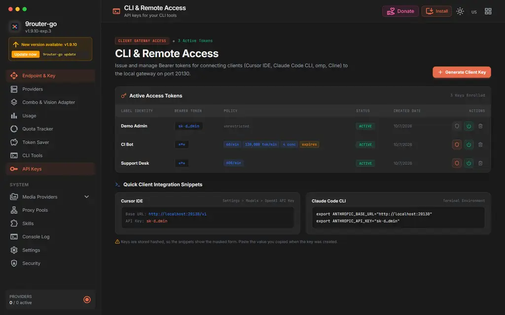
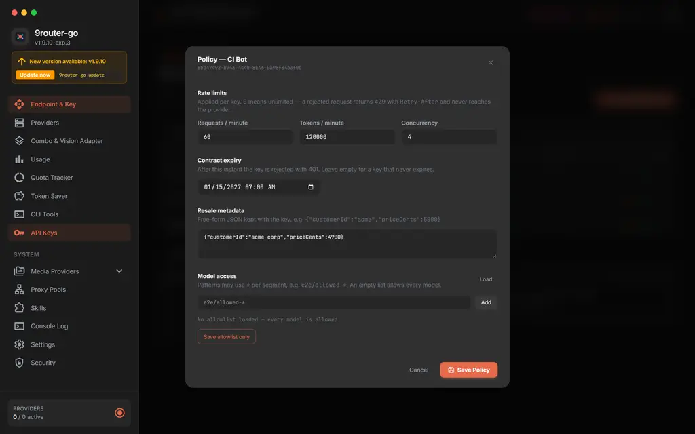
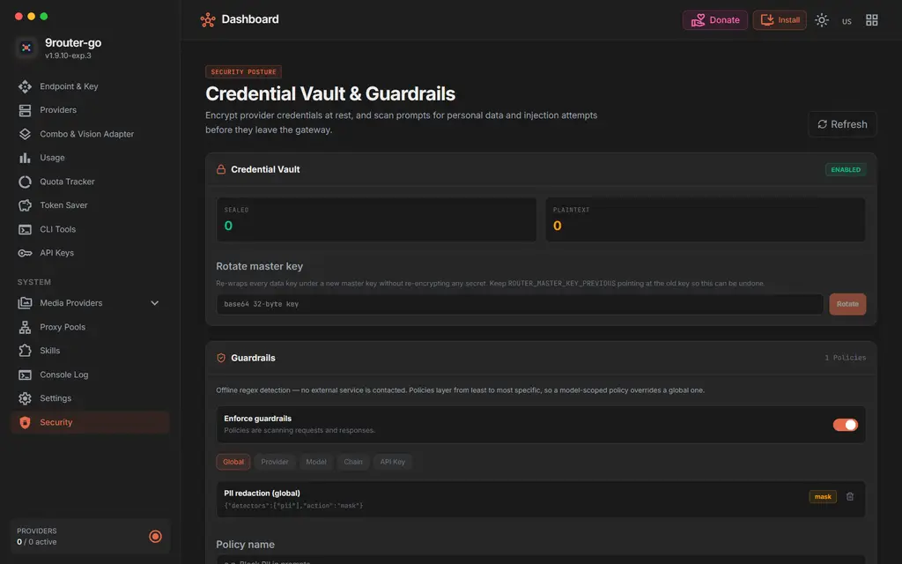

# KeiRouter port — dashboard screenshots

Screenshots of the surfaces this port changes. Captured from the real binary on
a throwaway `DATA_DIR` with seeded demo data (fake keys, one policy per scope) —
no real credentials are in any of these images.

| Surface | File | What changed |
|---|---|---|
| API Keys list — Policy column | `api-keys-policy-column.webp` | New **Policy** column rendering the effective per-key limits, plus the per-key policy button in **Actions**. |
| Per-key policy modal | `api-key-policy-modal.webp` | New modal: rate limits, contract expiry, resale metadata, model allowlist. |
| Security view | `security-vault-guardrails.webp` | New view: Credential Vault status + master-key rotation, guardrail policy editor, audit log, and the global **Enforce guardrails** kill-switch. |

## Policy column

Each row shows what the gateway will actually enforce, read back from the same
columns the limiter consults:

- `60/min · 120k tok/min · 4 conc · expires` — every limit set
- `600/min` — one limit set
- `unrestricted` — nothing configured (`0` = unlimited / all-allowed)

The bearer token itself is masked (`sk-d…min`), which is the visible half of the
breaking change: the plaintext is returned once at creation and never again.

## Per-key policy modal

Four sections, each corresponding to a plan requirement:

- **Rate limits** — RPM / TPM / concurrency. `0` means unlimited; a rejected
  request returns 429 with `Retry-After` and never reaches a provider.
- **Contract expiry** — after this instant the key is rejected with 401.
- **Resale metadata** — free-form JSON keyed by the operator, e.g.
  `{"customerId":"acme-corp","priceCents":4900}`.
- **Model access** — wildcard patterns (`*` per segment). An empty list allows
  every model. The same resolver gates both dispatch and `/v1/models`, so the two
  cannot disagree.

**Save allowlist only** writes the allowlist without touching the rate limits,
expiry, or metadata — otherwise opening this modal to add one model would silently
reset a key's limits to zero.

## Security view

**Credential Vault** — sealed vs plaintext connection counts, and master-key
rotation (re-wraps every data key; no secret is re-encrypted). Disabled entirely
until `ROUTER_MASTER_KEY` is set.

**Guardrails** — offline regex detection, no external service contacted. The
**Enforce guardrails** switch is the kill-switch: it stops both the request and
response taps without deleting the policy, so the audit trail survives. It defaults
to on, because a policy row is an explicit operator decision and must not be
silently ignored just because a setting was never written.

## Known gaps

Visible in these screens, not fixed by this port:

- The guardrail **audit log** is polled, not streamed live.
- There is no dry-run test box and no template picker (both are in the port plan
  under F-4 §4.6).
- The **Chain** scope is offered in the filter but the resolver never consults it,
  so a chain-scoped policy resolves to nothing.
- Rate limits have no settings-level global default; limits are per key only.
