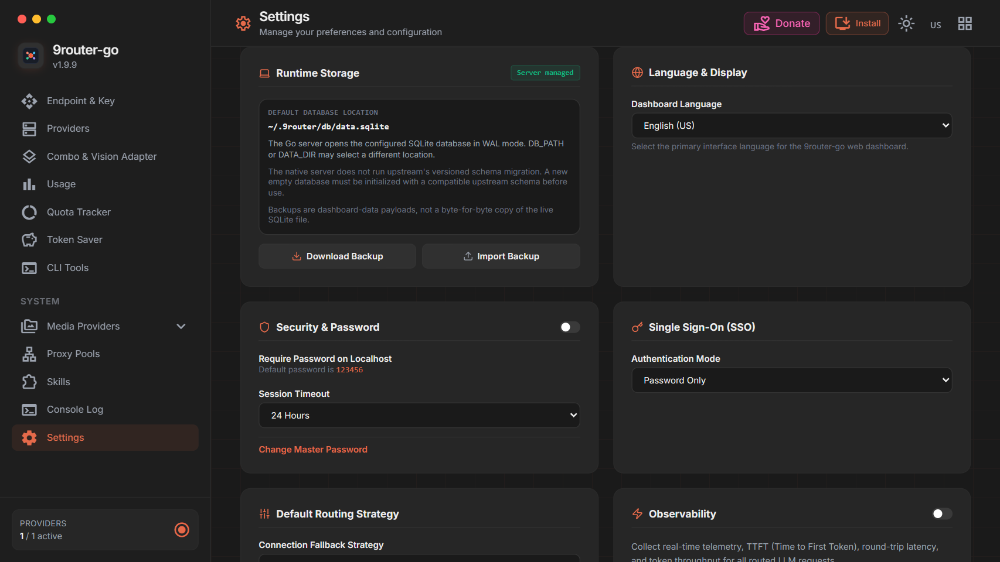
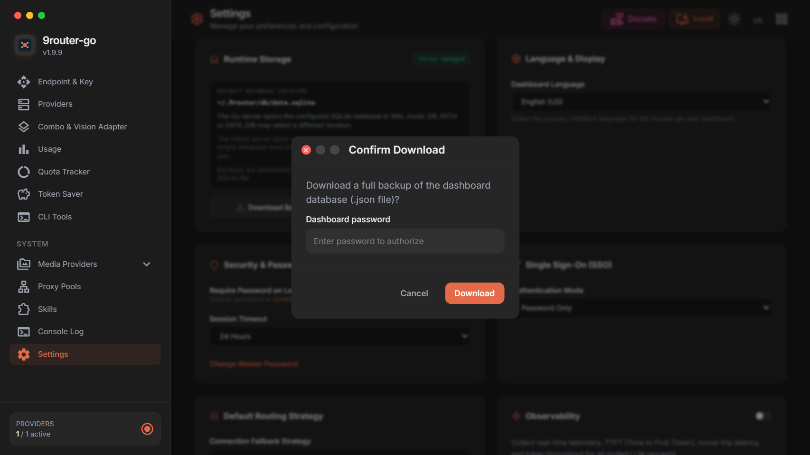

# Evidence — issue #160 (backup JSON, bukan zip)

Direkam dari binary `9router-go` yang benar-benar dijalankan di port 20999
dengan `DATA_DIR` sementara, bukan dari unit test. Tanggal: 2026-10-05.

## 1. Download lewat dashboard

Chromium membuka `http://127.0.0.1:20999/dashboard/profile`, login, lalu
menekan **Download Backup → Download**.



Modal konfirmasi menyebut `.json file` (sebelumnya `.zip archive`):



Klik **Download** menjalankan `GET /api/settings/database` (200), lalu
membuka `blob:http://127.0.0.1:20999/...` — browser merender isi JSON-nya
 langsung sebagai pretty-printed text, bukti bahwa yang diunduh memang file
JSON, bukan arsip.

## 2. Response header dan isi file

`evidence/export-headers.txt` — hasil `curl -D` dari endpoint yang sama:

```
HTTP/1.1 200 OK
Content-Disposition: attachment; filename="9router-backup-2026-10-05.json"
Content-Type: application/json
Content-Length: 532
```

`evidence/9router-backup-download.json` — body persis seperti yang diterima
user:

```json
{
  "providerConnections": [
    {
      "apiKey": "sk-evidence-demo",
      "authType": "apikey",
      "createdAt": "2026-10-05T15:44:35Z",
      "email": null,
      "id": "e1ae9f05-2f6f-48d8-a1a2-2726e95b9660",
      "isActive": true,
      "name": "backup-evidence",
      "priority": 1,
      "provider": "deepseek",
      "updatedAt": "2026-10-05T15:44:35Z"
    }
  ],
  "providerNodes": [],
  ...
}
```

Dua spasi per tingkat — sama seperti `JSON.stringify(payload, null, 2)`
milik upstream.

## 3. Parameter zip lama sudah mati

```
$ curl -D- ".../api/settings/database?format=zip"   | grep content-
Content-Disposition: attachment; filename="9router-backup-2026-10-05.json"
Content-Type: application/json

$ curl -D- -H "Accept: application/zip" ".../api/settings/database" | grep content-
Content-Disposition: attachment; filename="9router-backup-2026-10-05.json"
Content-Type: application/json
```

Keduanya mengembalikan JSON, bukan `application/zip`.

## 4. Round-trip: file unduhan benar-benar berestor

```
$ curl -X DELETE ".../api/connections/e1ae9f05-..."
{"id":"e1ae9f05-2f6f-48d8-a1a2-2726e95b9660","status":"ok"}

$ curl ".../api/connections"
[]

$ curl -X POST -H 'x-9r-password: 123456' \
       --data-binary @evidence/9router-backup-download.json \
       ".../api/settings/database"
{"success":true}

$ curl ".../api/connections"
[{"apiKeyMasked":"sk-evi…demo", ... "name":"backup-evidence","provider":"deepseek", ...}]
```

Koneksi yang dihapus kembali ada setelah file hasil unduhan di-POST — payload
berlekuk dibaca normal oleh `HandleImportDatabase`.

## Catatan

- Password instance smoke: `123456` (default upstream, tidak di-set di repo).
- Perbaikan issue #35 hanya meng-strip `password` dan `oidcClientSecret` dari
  blok `settings`; field kredensial koneksi tetap ikut agar backup bisa
  dipulihkan utuh (parity dengan upstream).
- ID koneksi dan `X-Request-Id` berasal dari instance sementara, bukan data user.